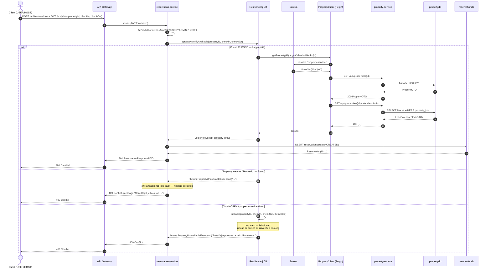

# Task 5 — Reservation → Property Availability Flow (Benjamin)

## Non-trivial communication

When a guest tries to create a reservation, **reservation-service** must
*synchronously* validate against **property-service** that the property exists,
is active, and has no overlapping calendar block for the requested
`checkIn` / `checkOut` window. If any of those checks fail the reservation must
**not** be persisted — letting an unverified booking through would cause
double-booking and conflicts with another team's `calendar-blocks` data.

This is non-trivial because the result depends on:
- the **reservation-service DB** (pending writes, transaction state) AND
- the **property-service DB** (`Property.isActive`, `CalendarBlock` rows for
  that property) AND
- the **availability** of property-service itself (handled with Resilience4j).

## Components
- `ReservationServiceImpl.createReservation(...)` and `batchCreate(...)` — call the gateway *before* `save()` / `saveAll()`.
- `PropertyAvailabilityGateway` — `@CircuitBreaker(name="property-service")` with a fail-closed fallback.
- `PropertyClient` — `@FeignClient(name="property-service")` (Eureka-resolved, no hardcoded host/port). Two endpoints:
  - `GET /api/properties/{id}` → `PropertyDTO`
  - `GET /api/properties/{id}/calendar-blocks` → `List<CalendarBlockDTO>`
- `PropertyUnavailableException` → mapped to **HTTP 409 Conflict** by `GlobalExceptionHandler`.

## Sequence diagram (Mermaid)

## Failure handling rationale (fail-closed)

| Scenario | Behaviour | Why |
|---|---|---|
| `property-service` returns 200 with `isActive=false` or an overlapping `CalendarBlock` | `PropertyUnavailableException` → 409 with the precise reason | Business validation — the user gets an actionable message |
| `property-service` returns 5xx or times out (read-timeout 3s, connect-timeout 2s) | Caught by Feign, surfaces as exception | Network/downstream failure — caller never silently succeeds |
| Failures cross the rate threshold (≥50% of last 10 calls, min 5 calls) | Circuit OPENS for 10s, then HALF-OPEN with 3 trial calls | Stop hammering a sick downstream and degrade fast |
| Circuit OPEN | `fallback(...)` runs and throws `PropertyUnavailableException("Pokušajte ponovo …")` → 409 | **Fail-closed**: in a booking domain, never confirm a reservation we couldn't verify (overbooking is worse than a transient 409) |
| `property-service` recovers | Circuit transitions HALF-OPEN → CLOSED automatically | No human intervention needed |

## "Loose coupling" answer (Task 5 question)

The synchronous call **does** create a temporal dependency
(reservation requests fail while property-service is down) but we keep coupling
loose along three axes:

1. **No code-level dependency on property-service:** reservation-service
   contains a tiny local DTO (`PropertyDTO`, `CalendarBlockDTO`) — only the
   fields it actually uses. Property-service can rename other fields freely.
2. **Discovery-based binding:** `@FeignClient(name="property-service")` resolves
   through Eureka. New property-service instances appear/disappear with no
   reservation-service redeploy.
3. **Bounded blast radius:** Resilience4j cuts the dependency at runtime when
   it sicks down — slow downstream cannot consume reservation-service threads.
   Operators can monitor `GET /actuator/circuitbreakers` to see the state.

For functionality that must *not* fail when property-service is down (e.g.
listing existing reservations, refunds, analytics) we deliberately do **not**
call property-service at all — those flows read only `reservationdb`. The sync
dependency is scoped strictly to the moment a new reservation is being
*created*.

## Tests

- `client/PropertyAvailabilityGatewayTest` — happy path, missing property,
  inactive property, overlapping block, invalid window, null args, fail-closed
  fallback (downstream down → 409), business-exception passthrough.
- `service/ReservationAvailabilityIntegrationTest` — proves
  `createReservation` calls the gateway *before* `save()` and that
  `batchCreate` aborts the whole batch on the first availability failure.
