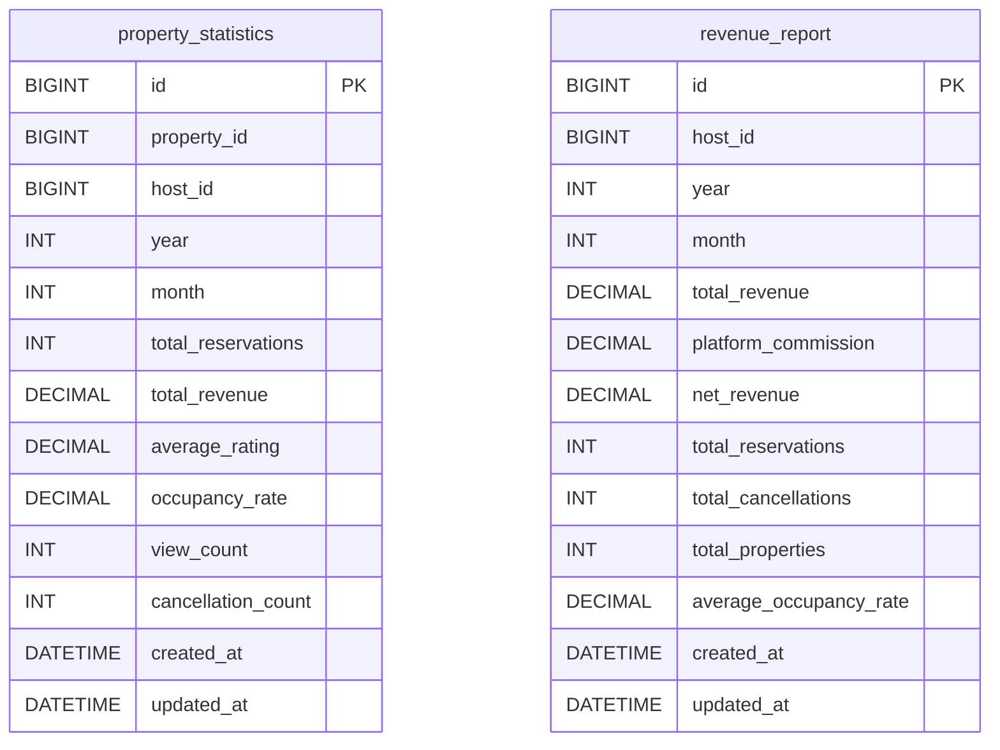

# Analytics Service – ERD Dijagram

**Baza podataka:** `analyticsdb`

## Entiteti

| Entitet | Opis |
|---|---|
| `property_statistics` | Mjesečne statistike po nekretnini (broj rezervacija, prihod, popunjenost, ocjena) |
| `revenue_report` | Mjesečni finansijski izvještaj domaćina (ukupan prihod, provizija platforme, neto prihod) |
