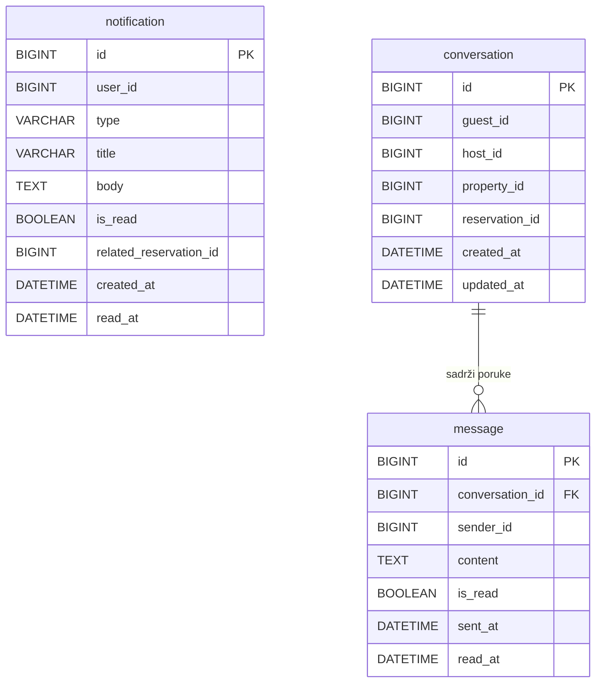

# Notification Service – ERD Dijagram

**Baza podataka:** `notificationdb`

## Entiteti

| Entitet | Opis |
|---|---|
| `notification` | Push/in-app notifikacija korisniku (NOVA_REZERVACIJA, POTVRDA, PODSJETNIK...) |
| `conversation` | Konverzacija između gosta i domaćina vezana za nekretninu/rezervaciju |
| `message` | Pojedinačna poruka unutar konverzacije |
