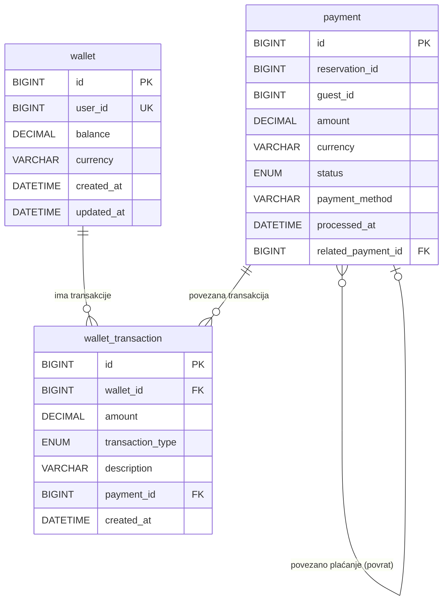

# Payment Service – ERD Dijagram

**Baza podataka:** `paymentdb`

## Entiteti

| Entitet | Opis |
|---|---|
| `wallet` | Virtualni novčanik korisnika |
| `payment` | Plaćanje rezervacije (PENDING/COMPLETED/FAILED/REFUNDED) |
| `wallet_transaction` | Transakcija na novčaniku (DEPOSIT/WITHDRAWAL/PAYMENT/PAYOUT/REFUND) |
