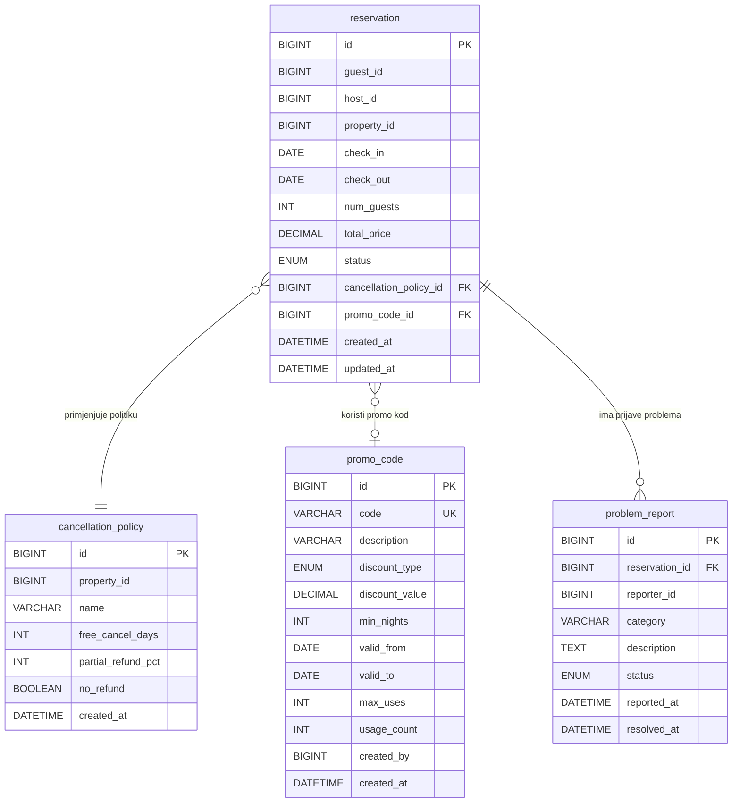

# Reservation Service – ERD Dijagram

**Baza podataka:** `reservationdb`

## Entiteti

| Entitet | Opis |
|---|---|
| `reservation` | Rezervacija smještaja (CREATED/CONFIRMED/COMPLETED/CANCELLED) |
| `cancellation_policy` | Politika otkazivanja (Fleksibilna/Umjerena/Stroga) |
| `promo_code` | Promotivni kodovi sa popustom (PERCENTAGE/FIXED) |
| `problem_report` | Prijave problema tokom boravka (REPORTED/IN_PROGRESS/RESOLVED) |
