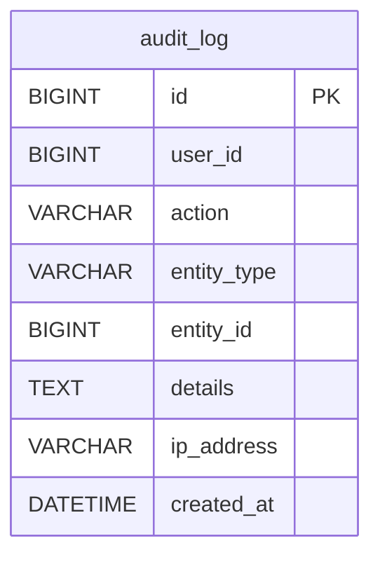

# System Events Service – ERD Dijagram

**Baza podataka:** `systemeventsdb`

## Entiteti

| Entitet | Opis |
|---|---|
| `audit_log` | Audit trail svih sistemskih akcija (CREATE/UPDATE/DELETE) nad entitetima (PROPERTY, RESERVATION, PAYMENT, REVIEW...) |
