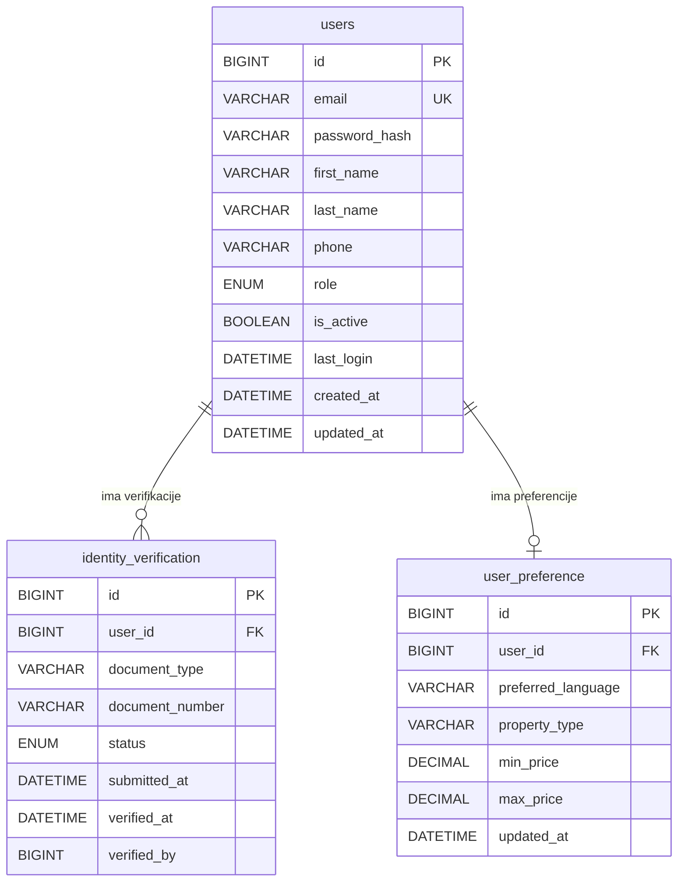

# User Service – ERD Dijagram

**Baza podataka:** `userdb`

## Entiteti

| Entitet | Opis |
|---|---|
| `users` | Registrovani korisnici (GUEST, HOST, ADMIN) |
| `identity_verification` | Dokumenti za verifikaciju domaćina (PENDING/APPROVED/REJECTED) |
| `user_preference` | Korisničke preferencije za pretrage (jezik, tip smještaja, raspon cijena) |
